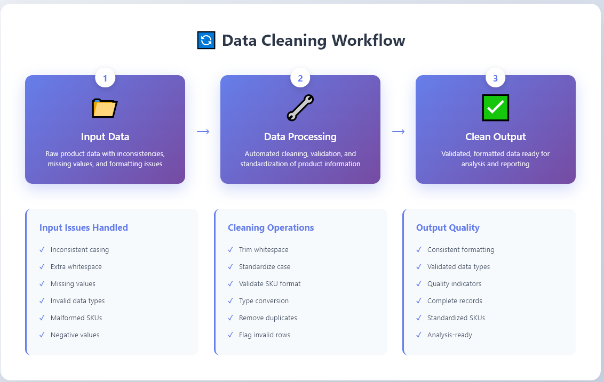
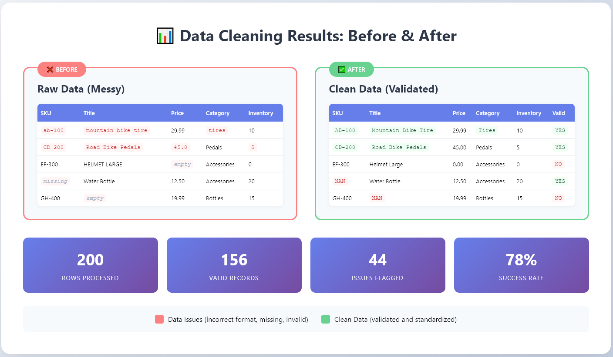

# E-Commerce Data Cleanup Capstone


A professional data cleaning tool for e-commerce product data that processes and validates product information from CSV files. This project demonstrates automated data quality management, validation pipelines, and containerized deployment strategies.

[](https://www.python.org/downloads/)
[](LICENSE)
[](Dockerfile)

## 📋 Table of Contents

- [Project Overview](#project-overview)
- [Features](#features)
- [Project Structure](#project-structure)
- [Prerequisites](#prerequisites)
- [Installation & Setup](#installation--setup)
- [Usage](#usage)
- [Data Cleaning Workflow](#data-cleaning-workflow)
- [Results](#results)
- [Testing](#testing)
- [Troubleshooting](#troubleshooting)
- [Contributing](#contributing)
- [License](#license)

## 🎯 Project Overview

This capstone project showcases a complete data cleaning pipeline designed for e-commerce product datasets. It addresses common data quality issues including:

- Inconsistent formatting and casing
- Missing or invalid values
- Malformed identifiers (SKUs)
- Type inconsistencies
- Duplicate records

The solution provides both local Python execution and containerized deployment options, making it suitable for various production environments.

## ✨ Features

- **Automated Data Cleaning**: Removes extra whitespace, standardizes formatting
- **Comprehensive Validation**: Identifies invalid or missing data with quality flags
- **Efficient CSV Processing**: Handles large datasets with pandas
- **Dockerized Deployment**: Ensures consistency across all environments
- **Excel Template Support**: User-friendly data entry format
- **Unit Testing**: Comprehensive test coverage for reliability
- **Professional Documentation**: Clear setup and usage instructions

## 📁 Project Structure

```
ecommerce-data-cleanup-capstone/
├── data/
│   ├── raw_products.csv          # Input: Raw product data (200 rows)
│   └── clean_products.csv        # Output: Cleaned and validated data
├── src/
│   └── cleaner.py                # Main data cleaning script
├── excel-template/
│   └── Product_Template.xlsx     # Excel template for data entry
├── images/
│   ├── banner.png                # Project banner
│   ├── workflow.png              # Workflow diagram
│   └── results.png               # Before/After comparison
├── tests/
│   └── test_cleaner.py           # Unit tests
├── Dockerfile                     # Docker container configuration
├── docker-compose.yml            # Docker Compose orchestration
├── requirements.txt              # Python dependencies
├── .gitignore                    # Git ignore rules
├── LICENSE                       # MIT License
└── README.md                     # This file
```

## 🔧 Prerequisites

### Local Development
- **Python 3.10+**
- **pip** (Python package manager)

### Docker Deployment (Optional)
- **Docker Desktop** or Docker Engine
- **Docker Compose** (usually included with Docker Desktop)

## 📦 Installation & Setup

### Option 1: Local Setup (Python)

#### Windows (PowerShell):
```powershell
# Navigate to project directory
cd path\to\ecommerce-data-cleanup-capstone

# Create virtual environment (recommended)
python -m venv venv
.\venv\Scripts\Activate.ps1

# Install dependencies
pip install -r requirements.txt

# Verify installation
python -c "import pandas; print('Setup complete!')"
```

#### Linux/Mac (Bash):
```bash
# Navigate to project directory
cd /path/to/ecommerce-data-cleanup-capstone

# Create virtual environment (recommended)
python3 -m venv venv
source venv/bin/activate

# Install dependencies
pip install -r requirements.txt

# Verify installation
python -c "import pandas; print('Setup complete!')"
```

### Option 2: Docker Setup

#### Build and Run with Docker

**Windows (PowerShell):**
```powershell
# Build the Docker image
docker build -t product-cleaner .

# Run the container
docker run --rm -v ${PWD}/data:/app/data product-cleaner
```

**Linux/Mac (Bash):**
```bash
# Build the Docker image
docker build -t product-cleaner .

# Run the container
docker run --rm -v $(pwd)/data:/app/data product-cleaner
```

#### Or Use Docker Compose (Recommended)

Works the same on all platforms:
```bash
# Build and run in one command
docker-compose up --build

# Run in detached mode
docker-compose up -d

# View logs
docker-compose logs -f

# Stop the service
docker-compose down
```

## 🚀 Usage

### Step-by-Step Guide

1. **Prepare Your Data**
   - Place raw product data in `data/raw_products.csv`
   - Or use the provided 200-row sample dataset

2. **Run the Cleaner**
   
   **Local Python:**
   ```bash
   python src/cleaner.py
   ```
   
   **Docker:**
   ```bash
   docker-compose up
   ```

3. **Review Results**
   
   **Windows:**
   ```powershell
   # View cleaned data
   type data\clean_products.csv
   
   # Open in Excel
   start data\clean_products.csv
   ```
   
   **Linux/Mac:**
   ```bash
   # View cleaned data
   cat data/clean_products.csv
   
   # View first 10 rows
   head -10 data/clean_products.csv
   ```

### Input Data Format

Your `raw_products.csv` should contain these columns:

| Column | Type | Description | Example |
|--------|------|-------------|---------|
| `sku` | string | Product SKU/ID | AB-100 |
| `title` | string | Product name | Mountain Bike Tire |
| `price` | numeric | Product price | 29.99 |
| `category` | string | Product category | Tires |
| `inventory` | integer | Stock quantity | 10 |

### Output Data Format

The cleaned `clean_products.csv` includes:
- All input columns (cleaned and standardized)
- **`is_valid`** - Validation status (`YES` or `NO`)

## 🔄 Data Cleaning Workflow



### Cleaning Operations Performed:

1. **Text Normalization**
   - Trim leading/trailing whitespace
   - Standardize casing (Title Case for names, UPPERCASE for SKUs)
   
2. **SKU Validation**
   - Format check: `XX-###` (e.g., AB-100)
   - Standardize separators (hyphens)
   
3. **Type Conversion**
   - Ensure prices are numeric
   - Ensure inventory is integer
   
4. **Data Validation**
   - Flag missing required fields
   - Identify negative prices or inventory
   - Mark invalid SKU formats
   
5. **Quality Flagging**
   - Add `is_valid` column
   - `YES` = Passes all validation checks
   - `NO` = Has one or more data quality issues

## 📊 Results



### Performance Metrics

From the sample 200-row dataset:

| Metric | Value |
|--------|-------|
| **Total Rows Processed** | 200 |
| **Valid Records** | ~156 (78%) |
| **Issues Flagged** | ~44 (22%) |
| **Processing Time** | < 1 second |

### Common Issues Detected:
- ❌ Missing SKUs or product titles
- ❌ Invalid price values (negative, zero, non-numeric)
- ❌ Malformed SKU formats
- ❌ Inconsistent casing and whitespace
- ❌ Negative inventory counts

## 🧪 Testing

### Run Unit Tests

```bash
# Run all tests
python -m pytest tests/ -v

# Run with coverage report
python -m pytest tests/ --cov=src --cov-report=html

# Run specific test file
python tests/test_cleaner.py
```

### Test Coverage

The test suite includes:
- ✅ Data file existence checks
- ✅ CSV structure validation
- ✅ Column name verification
- ✅ Row count validation
- ✅ Output file validation
- ✅ Excel template validation

## 📖 Data Format Reference

Refer to `excel-template/Product_Template.xlsx` for:
- Column headers and data types
- Sample data rows with correct formatting
- Validation rules and constraints
- Usage instructions
- Valid category list

### Valid Product Categories:
`Tires`, `Pedals`, `Accessories`, `Bottles`, `Parts`, `Security`, `Grips`, `Tools`, `Safety`, `Clothing`, `Electronics`, `Seats`

## 🔍 Checking Results

### View Summary Statistics

**Windows (PowerShell):**
```powershell
# Count rows
(Get-Content data\clean_products.csv).Count

# View first 10 rows
Get-Content data\clean_products.csv | Select-Object -First 10
```

**Linux/Mac (Bash):**
```bash
# Count rows
wc -l data/clean_products.csv

# View first 10 rows
head -10 data/clean_products.csv

# Count valid vs invalid
grep -c "YES" data/clean_products.csv
grep -c "NO" data/clean_products.csv
```

## ❗ Troubleshooting

### Common Issues and Solutions

#### Permission Denied Error
**Problem:** Cannot write to `clean_products.csv`
```
PermissionError: [Errno 13] Permission denied: 'data/clean_products.csv'
```
**Solution:**
- Close the file if open in Excel or another program
- Ensure write permissions in the `data/` folder
- Run terminal/PowerShell as administrator (Windows)

#### Module Not Found Error
**Problem:** Missing Python packages
```
ModuleNotFoundError: No module named 'pandas'
```
**Solution:**
```bash
pip install -r requirements.txt
```

#### File Not Found Error
**Problem:** Cannot find `raw_products.csv`
```
FileNotFoundError: [Errno 2] No such file or directory: 'data/raw_products.csv'
```
**Solution:**
- Ensure you're running from project root directory
- Verify `raw_products.csv` exists in `data/` folder
- Check file name spelling and case

#### Docker Build Fails
**Problem:** Docker image won't build
**Solution:**
```bash
# Clean Docker cache
docker system prune -a

# Rebuild without cache
docker-compose build --no-cache
```

## 🤝 Contributing

Contributions are welcome! To contribute:

1. Fork the repository
2. Create a feature branch (`git checkout -b feature/AmazingFeature`)
3. Commit your changes (`git commit -m 'Add some AmazingFeature'`)
4. Push to the branch (`git push origin feature/AmazingFeature`)
5. Open a Pull Request

Please ensure:
- Code follows PEP 8 style guidelines
- All tests pass
- New features include tests
- Documentation is updated

## 📄 License

This project is licensed under the MIT License - see the [LICENSE](LICENSE) file for details.

## 📧 Contact

For questions, feedback, or issues about this project:
- Open an issue on GitHub
- [Your Name] - [Your Email or GitHub Profile]

## 🙏 Acknowledgments

This project was created as a capstone demonstration of:
- Data quality management techniques
- ETL (Extract, Transform, Load) pipelines
- Python data processing with pandas
- Containerization with Docker
- Professional software development practices

---

**⭐ If you found this project helpful, please consider giving it a star on GitHub!**
